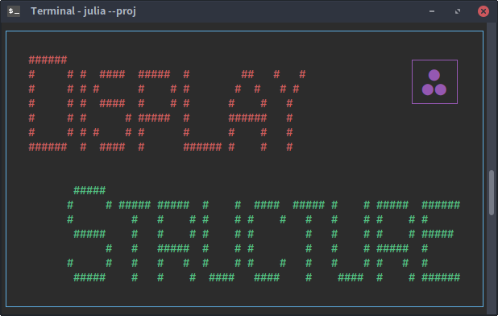
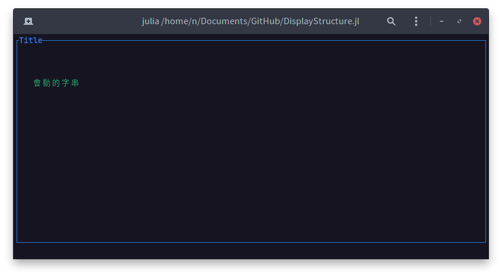

<h1 align="center">
    
    <br>
</h1>

| **Build Status**                                 |
|:------------------------------------------------:|
| ![CI][github-ci] [![][codecov-img]][codecov-url] |

[github-ci]: https://github.com/foldfelis/DisplayStructure.jl/workflows/CI/badge.svg

[codecov-img]: https://codecov.io/gh/foldfelis/DisplayStructure.jl/branch/master/graph/badge.svg

[codecov-url]: https://codecov.io/gh/foldfelis/DisplayStructure.jl

# Display Structure

DisplayArray provides arrays that index character in text width unit. And therefore maintains an immutable display size for terminal emulators.

## Quick start

The package can be installed with the Julia package manager.
From the Julia REPL, type `]` to enter the Pkg REPL mode and run:

```julia
pkg> add DisplayStructure
```

## Usage

### From scratch

1. Using package

```julia
julia> using DisplayStructure; const DS = DisplayStructure;
```

2. Declare an area

```julia
julia> area = DS.DisplayArray(DS.Rectangle(20, 100))
DisplayArray(size=(20, 100), background char=Char(32))
```

3. Declare a label

```julia
julia> str = "會動的字串"; width = textwidth(str); label = DS.DisplayRow(width)
DisplayRow(size=10, background char=Char(32))

julia> label[1:end] = str
"會動的字串"
```

4. Render area and label

```julia
julia> DS.render(area, pos=(1, 1)); DS.render(label, pos=(5, 5))
```

> **Hint: The result may be different from the picture showing bellow. One may need to integrate [Terming.jl](https://github.com/foldfelis/Terming.jl) to completely dominate terminal control.**

### With DisplayStack

with `DisplayStack`, one can easily construct a hierarchical display structure.

1. Using package

```julia
julia> using DisplayStructure; const DS = DisplayStructure;
```


2. Define a function that returns a `DisplayStack`

```julia
julia> function gen_form()
    display_stack =  DS.DisplayStack()
    push!(display_stack, :form => DS.Panel("Title", [20, 100], [1, 1]))
    push!(display_stack, :str => DS.Label("會動的字串", [5, 5]))

    return display_stack
end;

julia> form = gen_form();
```

3. Render it!!

```julia
julia> DS.render(form)
```



## Example

The [example](example/example.jl) demonstrates a minimum viable product
that shows a border and a string. Integrate with [keyboard key reading feature](https://gist.github.com/foldfelis/375dc13b2d3be792fdf029466d7761d0) (implemented under [Terming.jl](https://github.com/foldfelis/Terming.jl)), the movable string can be controlled by pressing `w`, `s`, `a` and `d`, press `ESC` to quit.

It is recommended that one use [Crayons.jl](https://github.com/KristofferC/Crayons.jl) to gain more decorations. A [example](example/logo.jl) shows how to integrate with Crayons.
